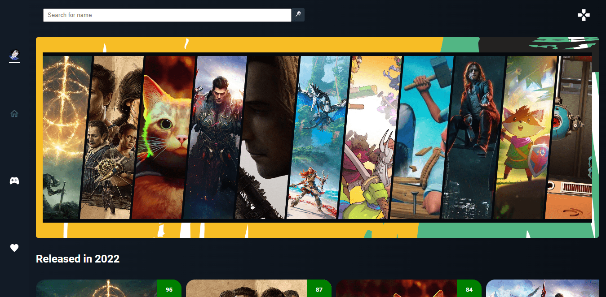

<h1 align="center">
   🔗 Game-store
</h1>

<a href="#descrição">🧾 Descrição</a> • 
<a href="#tecnologias">🚀 Tecnologias</a> • 
<a href="#features">🔨 Features</a> •
<a href="#possiveis-melhorias">🔝 Possiveis melhorias</a> •
<a href="#settings">⚙ settings</a> •
<a href="#license">📝 License</a> •
<a href="#autor">Autor</a>

<h2>🧾Descrição</h2>

<blockquote >
 Aplicativo de game com descrições, classificações e filtros de jogos. Consumindo uma API de jogos. RAWG Video Games Database
</blockquote>

<h2>🚀Tecnologias</h2/>

As seguintes ferramentas foram usadas na construção do projeto:

- [Firebase](https://firebase.google.com/)
- [TypeScript](https://www.typescriptlang.org/)
- [Scss](https://sass-lang.com/)
- [React-Icons](https://react-icons.github.io/react-icons/)

<h2>🔨Features</h2>

- [x] Listar os jogos.
- [x] Pagina onde pode-se ver as info do jogo.
- [x] Pesquisar por algum jogo.
- [x] Filtrar por jogos.
- [x] Adicionar os jogos como favoritos
- [x] Autenticação com o firebase.

<h2>🔝Possiveis melhorias</h2>

- [ ] Add paginação.
- [ ] Add outros filtros.
- [ ] Add um CRUD, onde o usuário poderá criar uma lista e add os jogos de sua preferência.

<h2>⚙Settings</h2>

Segue as instruções para baixar e executar o projeto na sua máquina:

<code>git clone</code> + <code>URL do Projeto</code>: clonar este repositório.

<code>cd game-store</code>: acessa a pasta do projeto no terminal.

<code>npm i</code>: para baixar as dependências do projeto.

<h3>🪛 Pegue as chaves necessárias</h3>
<li>Vá em <a href="https://rawg.io/apidocs" target="_blank">rawg.io</a> para pegar a primeira chave.</li>
<li>Para pegar a segunda vá em <a href="https://rapidapi.com/accujazz/api/rawg-video-games-database" target="_blank">rapidapi.com</a> e pegue a chave <code>X-RapidAPI-Key</code>. Caso haja dúvidas nessa parte você pode ir em <a href="https://docs.rapidapi.com/docs/keys#:~:text=Go%20to%20the%20API's%20Endpoints,with%20the%20new%20API%20key.">How to find your API key</a>.</li>

###

Depois renomeie o arquivo .env.example para .env e coloque o seguinte

<pre>
  VITE_API_KEY=' ' //primeira chave
  VITE_RAPID_KEY=' ' //segunda chave
</pre>

- <code>npm run dev</code>:
  Executa o projeto em modo/ambiente de desenvolvimento.

- Abra http://localhost:5173/ para ver o projeto rodando no Navegador.

<h2>📝License</h2>

Esse projeto está sob a licença MIT. Veja o arquivo <a href="https://github.com/the-matheuslima/blog-react/blob/main/LICENSE">LICENSE</a> para mais detalhes.

### Autor

---

<a href="https://github.com/the-matheuslima/">
 
  
 <b>Matheus Lima</b></a>

Feito com ❤️ por Matheus Lima 👋🏽 Entre em contato!
